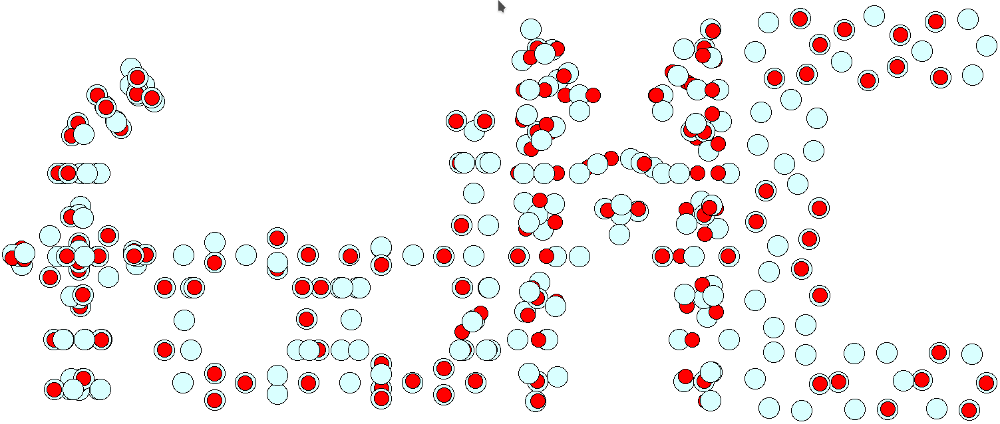

# fodMC - Fermi-orbital descriptor Monte-Carlo 

Main developer:  

*  Kai Trepte (KT, trept1k@cmich.edu)    

Sidekicks:  

* Sebastian Schwalbe (SS, theonov13@gmail.com)    
* Alex Johnson (AJ, johns1ai@cmich.edu)   
* Jakob Kraus (JaK, jakob.kraus@physik.tu-freiberg.de)   

Coding language: FORTRAN, Python 

## Description
The fodMC is a generator for Fermi-orbital descriptor (FOD) positions to be used in the Fermi-Löwdin orbital self-interaction correction (FLO-SIC) method.           
There is a publication, explaining the underlying idea of this program; please see

'Interpretation and automatic generation of Fermi-orbital descriptors', S. Schwalbe, K. Trepte, et al., Journal of Computational Chemistry, vol. 40, pp. 2843-2857, 2019


## Installation (local)

```bash 
git clone https://github.com/pyflosic/fodMC
cd fodMC
pip3 install -e .
```

The module is called 'fodmc'. 

There are examples to make you familiar with the execution. 
You can either work at the FORTRAN level (see examples/fortran) or 
use the Python-Overlay, see examples/python.


# ATTENTION
Initial FODs for transition metals and larger atoms may currently not be reliable.
This is due to the fact that the spherical symmetry of the core FODs (with is strictly enforced)
might not represent a good guess for such systems. Intensive research is needed to determine the 
correct structural motifs for such systems.


## Tutorials

There are several tutorial videos about the 
usage and handling of the fodMC at youtube, 
at the channel 'The extended Physiker Clan'.

In addition, there is a publication summarizing essential findings regarding FODs, see 
'Interpretation and automatic generation of Fermi-orbital descriptors', S. Schwalbe, K. Trepte, et al., Journal of Computational Chemistry, vol. 40, pp. 2843-2857, 2019
