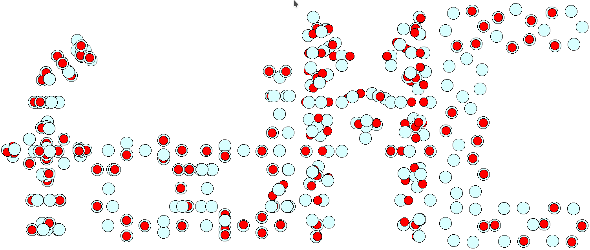

# fodMC - Fermi-orbital descriptor Monte-Carlo 

Main developer:  

*  Kai Trepte (KT, trept1k@cmich.edu)    

Sidekicks:  

* Alex Johnson (AJ, johns1ai@cmich.edu)   
* Jakob Kraus (JaK, jakob.kraus@student.tu-freiberg.de)   
* Sebastian Schwalbe (SS, theonov13@gmail.com)    

Coding language: FORTRAN   

## Description
   
Guess generator for FOD positions to be used in the Fermi-Löwdin orbital self-interaction correction (FLO-SIC) method.           
There is a manual, explaining the underlying idea of this program and showing some examples for its usage.

## Installation 
The fodMC is written in FORTRAN. Make sure you have a fortran compiler like gfortran to compile the code.
To compile the code, go to the *src* directory and type   

        bash compile.sh

## Running the code 

Go to the folders *examples*. 

#### Attention :heavy_exclamation_mark:  
Change the directory in the run.sh to your src-directory (see manual as well).                                         

Then, type 

        bash run.sh

to run the code for a given input in the file *system*.
